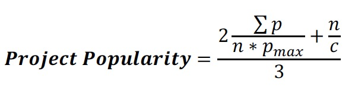
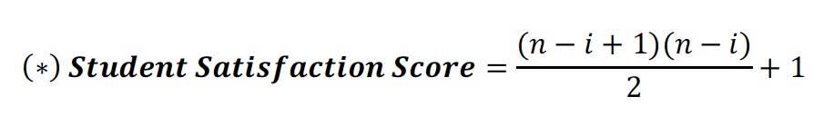

## Project Matching Algorithm

- [Input Data](#input-data)
- [Ranking Projects](#ranking-projects)
- [Initial Assignments](#initial-assignments)
- [Project Elimination](#project-elimination)
- [Bumping](#bumping)
- [Iteration and Final Solution](#iteration-and-final-solution)
- [References](#references)

### Input Data
The algorithm requires the following information in order to run:
- **Projects:** Project Name (String), Min Size (int), and Max Size (int)
- **Rankings:** Student Name (String), 1st Project Choice ID (int), 2nd Project Choice ID (int), etc...

### Ranking Projects
- Each Project is evaluated based on a **Project Popularity** metric, which takes into account how many Students are interested in it, and how highly:

  * **p = Student Satisfaction Score** (see below) of every Student who ranked this Project.
    * **p_max** = Maximum possible Student Satisfaction Score (a #1 ranking). This will depend on the # of Projects they are allowed to rank (see below).
  * **n** = Number of Students that ranked the Project.
  * **c** = Cut-Off Limit: the maximum number of Students than can sign up for each Project.

  * **n** = Total number of Projects that each Student is allowed to rank.
  * **i** = That individual Student's ranking of said Project.

### Initial Assignments
We iterate through each Student in random order and assign them their highest ranked Project possible, while not exceeding any Project's maximum group size.

### Project Elimination
- We iterate through the Projects from least popular to most popular and eliminate as many unpopular Projects as possible, so as long as doing so does not reduce the total number of remaining spots to below the number of Students still needing assignment.
- Students previously assigned to these eliminated Projects are moved to a pool of Unassigned Students.

### Bumping
- Students initially assigned to Projects that were just eliminated are reassigned here. These Students are assigned to one of their ranked Projects outright, if space permits.
- If not, they are temporarily assigned to their 1st choice. This displaces a random Student from said Project, who is then assigned to their next highest remaining choice, potentially bumping another Student. This happens 3 times until a satisfactory assignment is found. If not, this entire bumping attempt is reverted, and the originally unassigned Student goes back to being unassigned.
- There may still be a pool of unassigned Students by the end of this algorithm, which will be displayed to the Admin as members of an "Unassigned" Project.

### Iteration and Final Solution
This entire algorithm is run 30 times, and the iteration with the highest overall satisfaction score (average Student satisfaction score across all Projects) is displayed to the Admin.

### References
- [Research Paper](https://peer.asee.org/1909.pdf)
